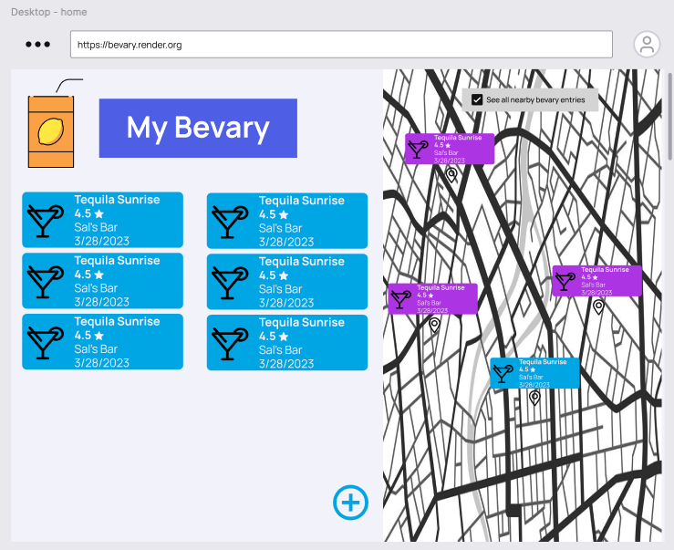

# Module 2 Group Assignment

CSCI 5117, Spring 2022, [assignment description](https://canvas.umn.edu/courses/355584/pages/project-2)

## App Info:

* Team Name: GoogleIt
* App Name: Bevary
* App Link: <https://TODO.com/>

### Students

* Jonathan Leibovich, leibo023@umn.edu
* Mike Cao, cao00121@umn.edu
* Chris Liu, liux3770@umn.edu
* Thien Nguyen, nguy3856@umn.edu

## Key Features

**Describe the most challenging features you implemented
(one sentence per bullet, maximum 4 bullets):**

* ...

Which (if any) device integration(s) does your app support?

* ...

Which (if any) progressive web app feature(s) does your app support?

* ...

## Mockup images

**[Add images/photos that show your mockup](https://stackoverflow.com/questions/10189356/how-to-add-screenshot-to-readmes-in-github-repository) along with a very brief caption:**

This is our landing page which will include the clerk Auth component

This is the List View which contains all previous entries sorted by ranking

This is the map view which allows you to see all of the locations of places you've rated

This is how you will create entries to add to your Bevary

This will be our view from a desktop, it simply combines the two main mobile views into a side by side view

## Testing Notes

**Is there anything special we need to know in order to effectively test your app? (optional):**

* ...

## Screenshots of Site (complete)

**[Add a screenshot of each key page](https://stackoverflow.com/questions/10189356/how-to-add-screenshot-to-readmes-in-github-repository)
along with a very brief caption:**

## External Dependencies

**Document integrations with 3rd Party code or services here.
Please do not document required libraries (e.g., Vue, Vuefire, Firebase).**

* Library or service name: description of use
* ...

**If there's anything else you would like to disclose about how your project
relied on external code, expertise, or anything else, please disclose that
here:**

...
