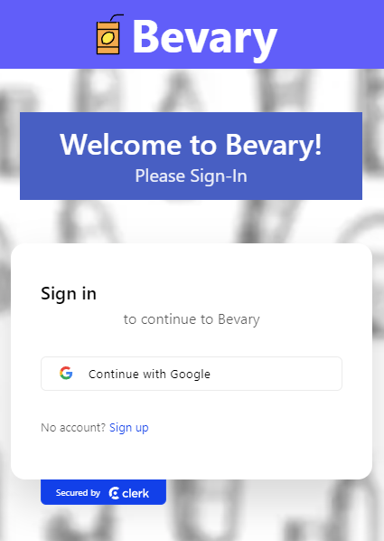
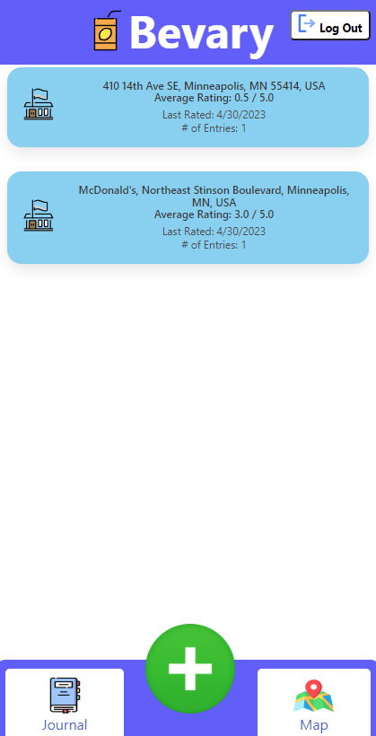
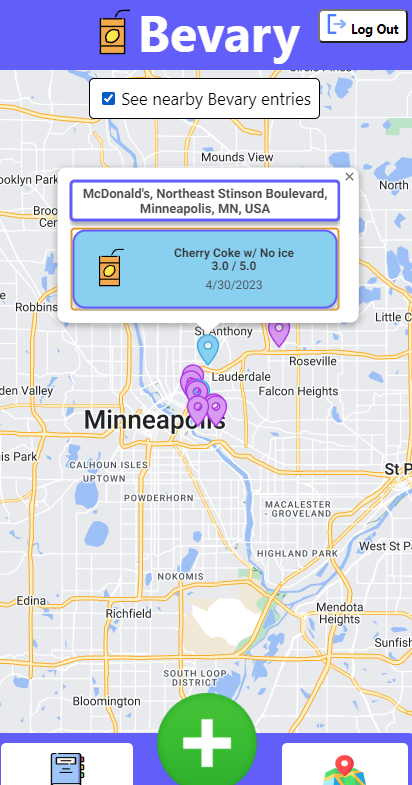
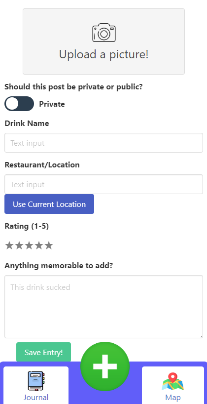
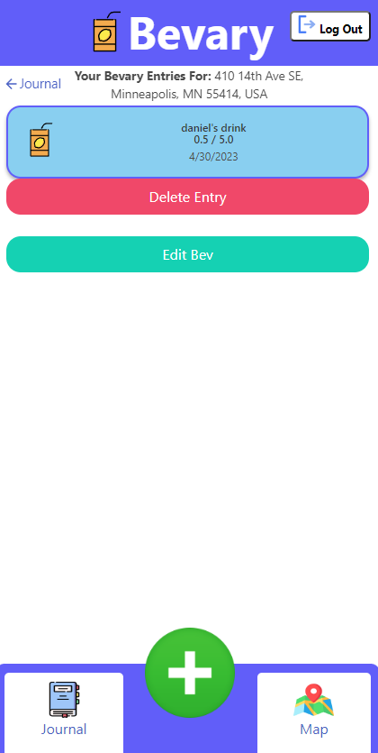
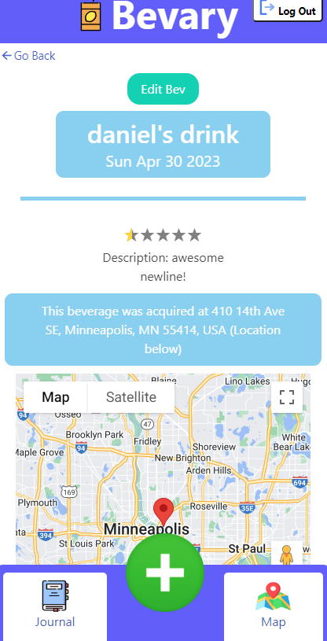

# Module 2 Group Assignment

CSCI 5117, Spring 2022, [assignment description](https://canvas.umn.edu/courses/355584/pages/project-2)

## App Info:

- Team Name: GoogleIt
- App Name: Bevary
- App Link: <https://incandescent-duckanoo-24e275.netlify.app/>

### Students

- Jonathan Leibovich, leibo023@umn.edu
- Mike Cao, cao00121@umn.edu
- Chris Liu, liux3770@umn.edu
- Thien Nguyen, nguy3856@umn.edu

## Key Features

**Describe the most challenging features you implemented
(one sentence per bullet, maximum 4 bullets):**

- Implementing the Google Maps Integration was challenging because we use maps in multiple places throughout the website as well as the Google Places Library. Google has funky restrictions about loading in their js multiple times.

- Integrating with Amazon S3 was challenging because the existing react component integrations were not very effective. We had to set up an identity pool with specific access on the AWS side and use that in order to upload photos to the buckets.

Which (if any) device integration(s) does your app support?

- Our website supports camera integration for mobile devices when uploading photos.

Which (if any) progressive web app feature(s) does your app support?

- Full responsiveness and browser compatibility, App-like interface, Discoverability and easy installation, Safety.

## Mockup images

**[Add images/photos that show your mockup](https://stackoverflow.com/questions/10189356/how-to-add-screenshot-to-readmes-in-github-repository) along with a very brief caption:**

This is our landing page which will include the clerk Auth component

This is the List View which contains all previous entries sorted by ranking

This is the map view which allows you to see all of the locations of places you've rated

This is how you will create entries to add to your Bevary

This will be our view from a desktop, it simply combines the two main mobile views into a side by side view

## Testing Notes

**Is there anything special we need to know in order to effectively test your app? (optional):**

- ...

## Screenshots of Site (complete)

This is our landing page which includes the clerk Auth component

This is the List View which contains all previous entries sorted alphabetically, with a logout button in the top right and an app-like nav bar at the bottom

This is the map view which allows you to see all of the locations of places of the beverages you've rated. An example pin has been clicked, and all nearby public bevary entries are toggled viewable.

Creation page of a Bevary entry. Mobile has support of taking a photo from camera, or choosing an image from the camera roll. Has option to make public or private. Field inputs for drink name, location, and memorable things about the drink. Has responsive star rating, and buttons to use current location and to save the entry. **Note: this page is the exact same as the edit page, except the edit page has all fields filled in.**

List of bevary entries made at a certain location. Delete and edit buttons for each bevary entry.

Your own bevary entry, editable, with ranking and your description and location that you set. Has a go-back navigation link.

## External Dependencies

**Document integrations with 3rd Party code or services here.
Please do not document required libraries (e.g., Vue, Vuefire, Firebase).**

- Library or service name: description of use
- Google Maps
- Google Places
- Amazon S3

**If there's anything else you would like to disclose about how your project
relied on external code, expertise, or anything else, please disclose that
here:**

Code references are available in the comments of the respective files.
